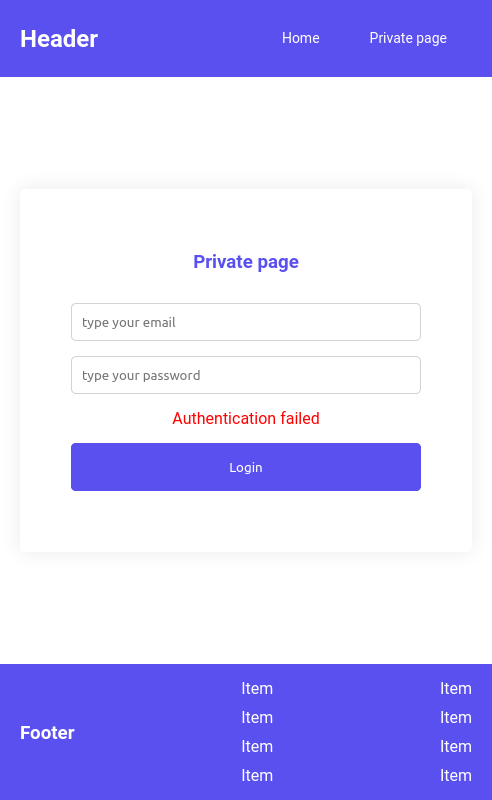

# Authentication basic React project

> Scroll for description, details and demonstrations

&nbsp;

_Note: In this develop, don't was used a data backend, only was made a simulation a requests to backend using fixed data user._

&nbsp;

### Description

The intention of this development is to simulate user authentication using React JS with real market practices.

&nbsp;

### Tools

- Context API
- Router
- Token
- Persistence

### Libs

- React Router DOM
- Axios

&nbsp;

## Available Scripts

After then install the dependencies, in the project directory, you can run:

### `npm start`

&nbsp;

## Demonstrations

&nbsp;

- _Before Authentication_
  &nbsp;
  > 

&nbsp;

- _After Authentication_
  &nbsp;
  > 

&nbsp;

_Talk to me on [LinkedIn]_

[linkedin]: https://www.linkedin.com/in/dsrivan/
